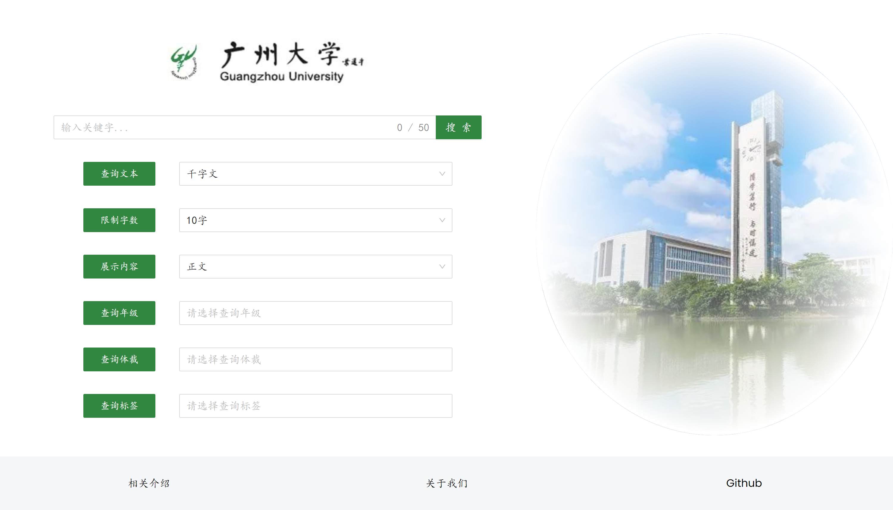
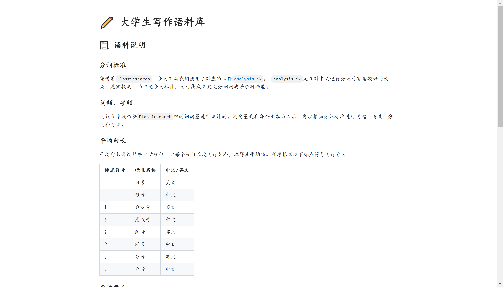

# 👋 GZC Frontend

`GZC` is a tiny corpus search engine built on Guangzhou University.
It integrates the basic advanced search, text analysis and visible platform.

This repository is only the frontend part. The backend part is [here]().

## 🔮 Snapshot

1. Basic home page.


2. Result show page.


In this page, you can also the details of each item.


3. Documentation page.


🧐 You can explore yourself by accessing the [page](https://corpus.chouyatou.live)

## ⚙️ Running

Here we use `yarn` package management tool. So before running, 
please ensure the `yarn` command can be used.

```bash
# clone repository to local
$ git clone git@github.com:ChenYuTong10/gzc-frontend.git

# change to project root directory
$ cd gzc-frontend

# install project dependencies
$ yarn install

# run the project
$ yarn start
```

After that, open `http://localhost:3000` in the browser.
