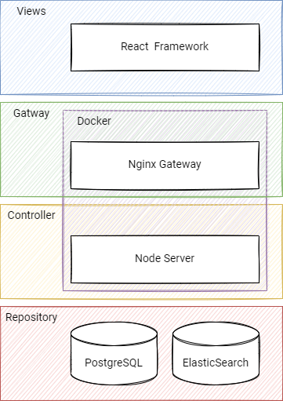

# ✏️ 大学生写作语料库

## 📃 语料说明

### 分词标准

凭借着`Elasticsearch`，分词工具我们使用了对应的插件[`analysis-ik`](https://github.com/medcl/elasticsearch-analysis-ik)。
`analysis-ik`是在对中文进行分词时有着较好的效果，是比较流行的中文分词插件，同时集成自定义分词词典等多种功能。

### 词频、字频

词频和字频根据`Elasticsearch`中的词向量进行统计的。词向量是在每个文本录入后，自动根据分词标准进行过滤，清洗，分词和存储。

### 平均句长

平均句长通过程序自动分句，对每个分句长度进行加和，取得其平均值。程序根据以下标点符号进行分句。

| 标点符号 | 标点名称 | 中文/英文 |
|------|------|-------|
| .    | 句号   | 英文    |
| 。    | 句号   | 中文    |
| !    | 感叹号  | 英文    |
| ！    | 感叹号  | 中文    |
| ?    | 问号   | 英文    |
| ？    | 问号   | 中文    |
| ;    | 分号   | 英文    |
| ;    | 分号   | 中文    |

### 平均段长

平均段长通过程序自动分段，对每个段落长度进行加和，取得其平均值。目前，程序根据以下换行符或回车符`\n`进行分段。

## ⚙️系统说明

### 存储层

大学生写作语料库具有大量文本查询的特点，且其实时性要求并不高。
因此，在技术选型时，使用工业界中较为成熟的软件[`Elasticsearch`](https://www.elastic.co/)对大量文本数据进行分析，处理和存储。

此外，为了进一步提高检索的效率，我们把一些固定的内容以离线的方式存储到`PostgreSQL`数据库中，
避免`Elasticsearch`反复对文本进行分析，处理。同时，`PostgreSQL`数据库担任存储正常系统的业务数据。

### 服务层

考虑到项目可能存在快速迭代的现象，我们使用易于上手，便于敏捷开发的[`Nodejs Express`](https://expressjs.com/)框架，
其承担起相应外来的查询，分析等业务请求，并将数据进行处理返回。

### 视图层

视图层使用了当今较为流行的前端框架[`ReactJS`](https://reactjs.org/)，可以避免繁琐，复杂的重复性编码工作，
便于对逻辑进行抽象，封装，利于开发和维护。

    

